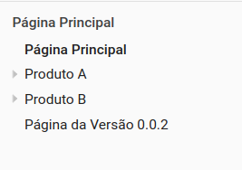
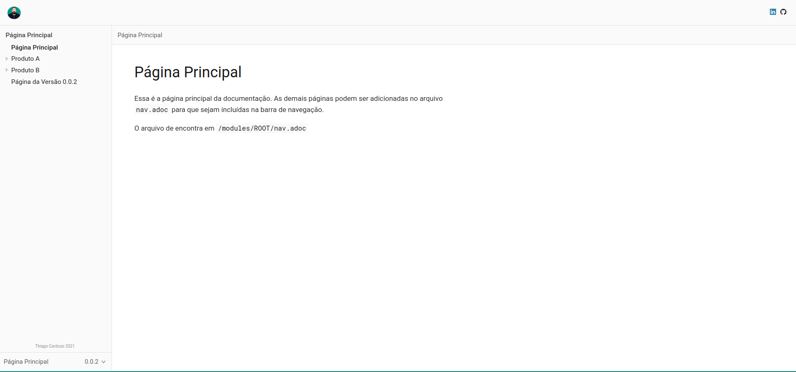

= Demo para Utilização do Antora

O https://antora.org/[*Antora*] permite a criação de um site estático a partir de um conjunto de documentos no formato https://asciidoc.org/[*AsciiDoc*].

== Visualização da Demo

Para visualizar o resultado da demo com base nos arquivos desse repositório, você pode:

* Clonar esse repositório, acessar a pasta `docs` e abrir o arquivo `index.html`.
* Acessar a página gerada e disponibilizada através do https://cardoso-thiago.github.io/site-antora-demo/[*Github Pages*]

== Explicação da Demo e Configurações

=== Arquivo Playbook

Esse é o arquivo responsável por pegar obter os fontes que serão utilizados para geração do site.

[yaml]
----
site:
  title: Demo Antora Docs
  start_page: main::main.adoc
content:
  sources:
  - url: https://github.com/cardoso-thiago/site-antora-demo.git
    branches: [0.0.1, 0.0.2]
output:
  dir: ./docs
ui:
  bundle:
    url: theme/ui-bundle.zip
    snapshot: true
  supplemental_files:
    - path: ui.yml
      contents: |
        static_files: [ .nojekyll ]
    - path: .nojekyll
----

==== Explicação das Configurações do Arquivo Playbook

* Start Page: O arquivo que irá gerar a página principal do site.
* Content: No atributo `sources` foi inserida a url do repositório onde se encontram as documentações, no caso, a desse mesmo repositório. As `branches` foram utilizadas para controle de versão da documentação. Mais de um repositório pode ser referenciado nessa configuração.
* Output: A pasta onde serão gerados os arquivos do site. A pasta `docs` foi utilizada nesse caso para deixar os arquivos prontos no caminho esperado pela configuração do *Github Pages*.
* UI / Bundle: O caminho do arquivo de tema para geração do site. Essa configuração também aceita uma url. O tema utilizado nessa demo está no próprio repositório e foi customizado em cima do tema do https://gitlab.com/stack-labs/oss/antora-theme[Stack-Labs].
* UI / Supplemental Files: Aqui foi adicionado o processo para criação de um arquivo `.nojekyll` na raiz do projeto gerado. Esse arquivo é necessário para que o *Github Pages* não tente gerar o conteúdo do site utilizando o *Jekyll*, já que nesse caso, estamos forncendo todos os arquivos necessários. Sem esse arquivo, o css, javascript e imagens do build não serão referenciados.

=== Arquivo Antora

Esse é o arquivo de configuração do repositório em si. O arquivo *Playbook* pode referenciar mais de um repositório e cada um desses repositórios deve conter na raiz um arquivo `antora.yml`.

[yaml]
----
name: main
title: Página Principal
version: 0.0.2
start_page: ROOT:main.adoc
nav:
- modules/ROOT/nav.adoc
----

==== Explicação das Configurações do Arquivo Antora

* Name: O nome para o conjunto de documentações. Nas configurações do *Playbook*, onde a página inicial é informada, foi utilizada a nomenclatura `main::main.adoc`, onde *main* é de fato, o nome dessa configuração que representa esse módulo e *main.adoc* o nome do arquivo existente nesse módulo.
* Title: O título da página.
* Version: A versão desse módulo. Se existirem versões diferentes da documentação, separadas por branches, a versão nessa configuração deve ser diferente em todas as branchs, caso contrário, ocorrerão erros de duplicidade na geração do site.
* Start Page: A página inicial do módulo.
* Nav: O arquivo de navegação do site. Devem ser informados aqui os links de acesso para as páginas seguindo o padrão de https://docs.asciidoctor.org/asciidoc/latest/lists/unordered/#nested-unordered-list[listas aninhadas] do *AsciiDoc*.

=== Alterações e Build do Tema

O tema utilizado nessa demo foi o tema da https://gitlab.com/stack-labs/oss/antora-theme[Stack-Labs], mas qualquer tema pode ser utilizado e customizado, bastando alterar a configuração `ui:bundle:url`.

Na página do *Stack-Labs* são listados todos os passos para o build do tema fornecido por eles. As alterações do tema podem ser realizadas na pasta `src` do projeto. Com o comando `gulp preview`, é possível visualizar o preview das alterações.

O comando `gulp bundle` gera um arquivo zip na pasta de build. Esse arquivo pode ser referenciado diretamente na configuração do *Playbook*, como foi feito nessa demo. Ele também pode ser publicado em algum lugar comum para que seja utilizado por diversas documentações, sendo referenciado pelo link de download do arquivo zip.

